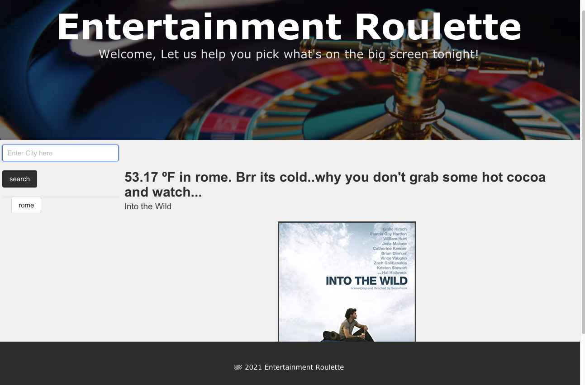

# entertainment-roulette

https://es2013.github.io/entertainment-roulette/

# Screen Shot

# User-Story
As a person wanting to watch a movie
I get overwhelmed when it comes to deciding what to watch
I want an application that will choose the movie based on the current weather outside

# Description
Entertainment Roulette helps users whittle down the exhausting activity of choosing a movie from endless options. It also chooses a movie that suits you based on the current weather outside. So whether you want to get cozy with a winter movie like Groundhog Day, or live for Summer and watch 500 days of Summer there is something for you.

# Free API's used
1.) OMDpApi.com
2.) OpenWeatherMap.org

# CSS Frameworks used
1.) PureCSS
2.) Bulma.io

# Roadmap for future developments
Adding more movies to our database and other inputs to choose a movie other than weather. 
Adding more selections for description of the movie based on the weather options like raining, snowing, and gloomy days ect. 
